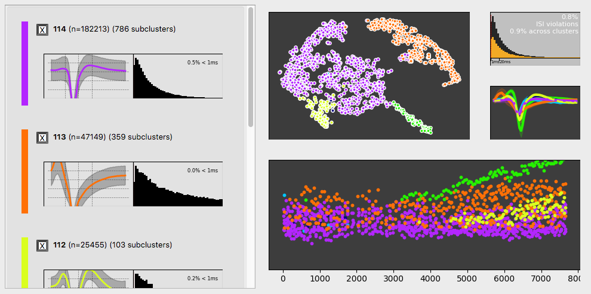

# SUSS (Semi-aUtomated Spike Sorter)

Semi-automated spike sorting for single channel electrophysiology. Designed for sorting extracellular signals on single channels with non-stationary units (waveforms changing over time).


*Example of results after running automated clustering and manual cluster selection*

## Usage

#### Spike sorting

Prepare your data into arrays of spike waveforms and spike arrival times. The sorting function takes three parameters

`times`: 1-dimensional array of length N\_spikes, each element is the arrival time of a spike in seconds

`waveforms`: 2-dimensional array of shape (N\_spikes, N\_samples), each row is a spike waveform

Usage example:

```python
import suss.io
from suss.sort import sort

# Load your own spike dataset
data = suss.io.read_pickle(...)

# Run the sorting algorithm
sort_result = sort(data.times, data.waveforms)

# Write the output of sorting
suss.io.save_pickle(..., sort_result)
```

#### Cluster merging (curation)

The output of sort() returns 20 to 40 putative clusters in the dataset. We provide a gui tool to assist in the visual assessment of spike clusters and convenient merging and deletion of clusters.

Run the gui (from within your python environment) and load the pickle file saved from using suss.sort:

```bash
python -m suss.gui.app
```



#### Spike detection

Not implemented (yet?). Use your favorite spike thresholding / detection method.  

## Installation and Dependencies

This project requires Python3.5+ (I recommend using a virtualenv.)

#### From your python environment

(with pip)
```
git clone https://github.com/theunissenlab/solid-garbanzo.git
pip install solid-garbonzo

# uninstall
pip uninstall suss
```

(standard)
```
git clone https://github.com/theunissenlab/solid-garbanzo.git
cd solid-garbonzo
python setup.py build
python setup.py install
```
*This should install the package as well as its depenencies*

#### Creating a isolated python virtual environment

Separately, install python [virtualenv](https://virtualenv.pypa.io/en/stable/installation/) and make sure you have python3 installed.

```
git clone https://github.com/theunissenlab/solid-garbanzo.git
cd solid-garbanzo
virtualenv env --python python3
source bin/activate
pip install -r requirements.txt
```

#### Other dependencies

* `ffmpeg` for creating HTML5 animated plots in notebooks

* `imagemagick` for generating animated plots in gif format

## Documentation

Uhhh. TBD.

## References

Dhawale AK, Poddar R, Wolff BE, Normand VA, Kopelowitz E, Olveczky BP. Automated long-term recording and analysis of neural activity in behaving animals. eLIFE, 2017

Hill DN, Mehta SB, Kleinfeld D. Quality Metrics to Accompany Spike Sorting of Extracellular Signals. JNeurosci, 2011
